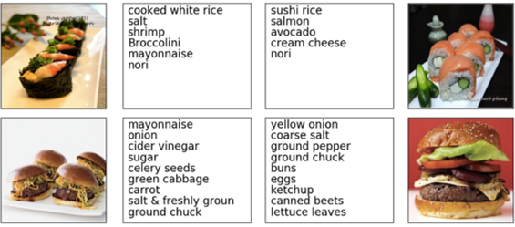
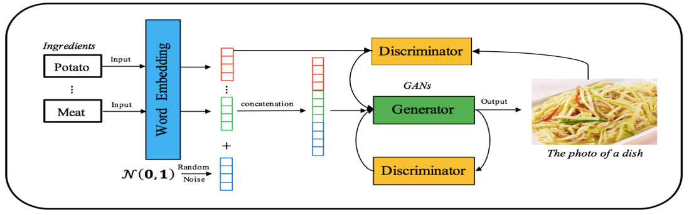
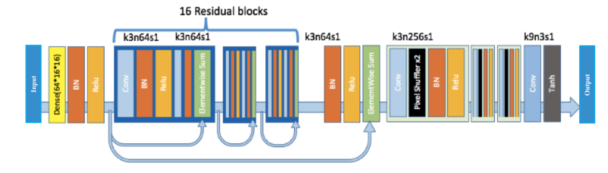
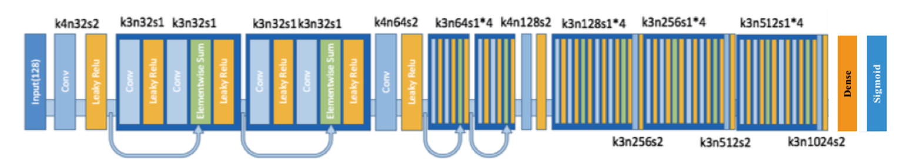
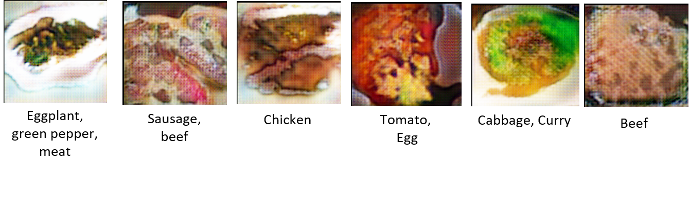

## What2eat: An Ingredients-based Food Image Generation Approach

<b>Zhiyu Yin, Yiming Li, Wendong Xu</b>

### Abstract

In this project, we design an ingredients-based food image generation model, the **What2eat**, to generate a food’s picture according to the ingredients text provided by the user. This project aims to recommend the food to users according to their preference. In general, What2eat containing two main modules: the word embedding module and conditional generative adversarial networks. In contrast to the traditional recommendation model, this model can provide the option out of the dataset due to the characteristic of GANs.

### Motivation

It is difficult to decide what to eat specifically. But providing the ingredients you want to eat is relatively simple.

### Dataset Description

- Over 1M recipes and 13M images.
- Over 16k ingredients, but only 4000 account for 95% of occurrences. 

<b>Fig.1.Some samples from Recipe1M dataset.</b>

### Model Description

We designed the model as Fig 2 shows. We use the ingredients as the raw input, doing word embedding to these words before sending them to our model. Concatenating the embedded vector and noise generated from a normal distribution as the input of our model. We used two discriminators for the generator training.

<b>Fig.2. The overall framework of What2eat.</b>

The generator’s architecture is shown in Fig 3, which is a modification from SRResNet. The model contains 16 ResBlocks and uses 3 sub-pixel CNN for feature map upscaling. 

<b>Fig.3. Generator network.</b>

Fig 4 shows the discriminator architecture, which contains 10 Resblocks in total. All batch normalization layers are removed in the discriminator, since it would bring correlations within the mini-batch, which is undesired for the computation of the gradient norm. We add an extra fully-connected layer to the last convolution layer as the attribute classifier. All weights are initialized from a Gaussian distribution with mean 0 and standard deviation 0.02. 

<b>Fig.4. Discriminator network.</b>

### Experiment and Evaluation

We selected several result generated images as follows. The sentences below the images are inputs.

### Future Work

- Further enhance the performance of the model.

- Generate the recipe for food in addition to generating dishes image.

- Add a speech recognition module in front of the NLP module to enter ingredients based on voice rather than pure text.

#### Reference

[1]. Salvador, Amaia , et al. "Learning Cross-Modal Embeddings for Cooking Recipes and Food Images." CVPR, 2017.

[2]. Mikolov, Tomas , et al. “Distributed Representations of Words and Phrases and their Compositionality.” NIPS, 2013.

[3]. Ledig, Christian, et al. "Photo-realistic single image super-resolution using a generative adversarial network." CVPR, 2017.
